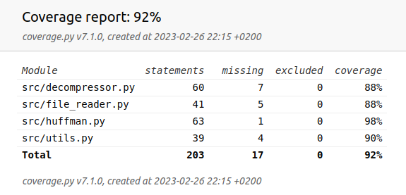

## Test document

The tricky part is to test the parser one part at a time. To make this easier I keep track of the current bit index so that the parser can be quickly set to a specific place in the parsing. 


## Run tests:

Install dep:
```
pip install poetry
poetry install
```

Run tests and get test coverage (from root dir):
```
poetry run coverage run -m pytest
poetry run coverage html
```

## Coverage:
